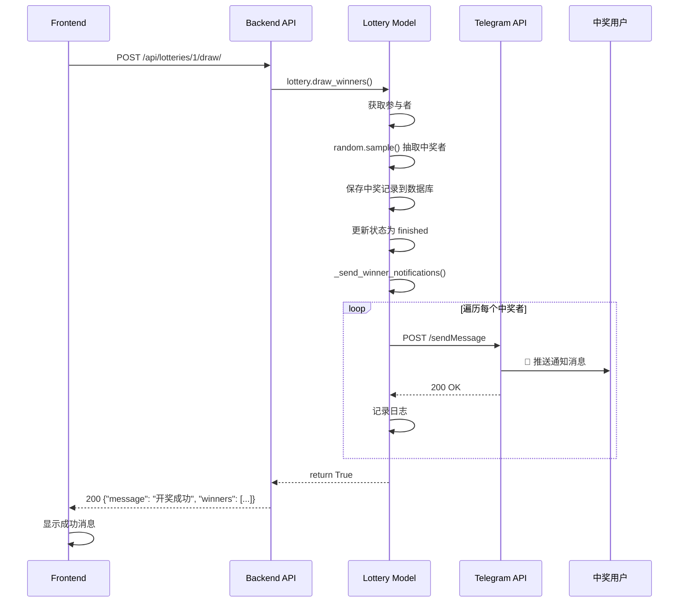

# 🔔 抽奖通知逻辑详解

## 📊 完整流程图

```mermaid
graph TD
    A[管理员在前端点击开奖] --> B[前端调用 POST /api/lotteries/:id/draw/]
    B --> C[后端 views.py 接收请求]
    C --> D{检查抽奖状态}
    D -->|状态不是 active| E[返回错误: 抽奖未进行中]
    D -->|状态是 active| F[调用 lottery.draw_winners]
    
    F --> G[获取所有参与者]
    G --> H{参与人数 vs 奖品数量}
    H -->|人数 < 奖品| I[所有人中奖]
    H -->|人数 >= 奖品| J[random.sample 随机抽取]
    
    I --> K[创建中奖记录 Winner]
    J --> K
    K --> L[收集中奖用户列表 winner_users]
    L --> M[更新抽奖状态为 finished]
    M --> N[调用 _send_winner_notifications]
    
    N --> O{检查 BOT_TOKEN}
    O -->|未配置| P[记录警告日志]
    O -->|已配置| Q[遍历每个中奖者]
    
    Q --> R[构造通知消息]
    R --> S[调用 Telegram Bot API]
    S --> T[POST https://api.telegram.org/bot{token}/sendMessage]
    T --> U{发送结果}
    
    U -->|成功 200| V[记录成功日志]
    U -->|失败| W[记录错误日志]
    
    V --> X{还有其他中奖者?}
    W --> X
    X -->|是| Q
    X -->|否| Y[返回开奖结果给前端]
    Y --> Z[前端显示成功消息]
    
    P --> Y
    E --> AA[前端显示错误消息]
    
    style N fill:#51cf66
    style S fill:#ff6b6b
    style T fill:#ffd43b
```

---

## 🎯 核心组件

### 1. 前端触发 (Frontend)

**文件**: `frontend/src/views/LotteryList.vue`

```javascript
async drawLottery(id) {
  try {
    await this.$confirm('确定要开奖吗？', '提示', {
      confirmButtonText: '确定',
      cancelButtonText: '取消',
      type: 'warning'
    })
    
    // 调用后端 API
    await api.drawLottery(id)
    this.$message.success('开奖成功')
    this.loadLotteries()
  } catch (error) {
    if (error !== 'cancel') {
      this.$message.error('开奖失败')
    }
  }
}
```

**API 调用**: `POST /api/lotteries/{id}/draw/`

---

### 2. 后端 API 接口 (Backend Views)

**文件**: `backend/lottery/views.py`

```python
@action(detail=True, methods=['post'])
def draw(self, request, pk=None):
    """执行开奖"""
    lottery = self.get_object()
    
    # 1. 检查状态
    if lottery.status != 'active':
        return Response({'error': '抽奖未进行中'}, status=400)
    
    # 2. 执行开奖（核心逻辑）
    success = lottery.draw_winners()
    
    # 3. 返回结果
    if success:
        winners = lottery.winners.all()
        serializer = WinnerSerializer(winners, many=True)
        return Response({
            'message': '开奖成功',
            'winners': serializer.data
        })
    else:
        return Response({'error': '开奖失败'}, status=400)
```

**关键点**：
- ✅ 验证抽奖状态必须是 `active`
- ✅ 调用模型的 `draw_winners()` 方法
- ✅ 返回中奖者列表

---

### 3. 开奖核心逻辑 (Models)

**文件**: `backend/lottery/models.py`

```python
def draw_winners(self):
    """执行开奖"""
    # 步骤1: 检查状态
    if self.status != 'active':
        return False
    
    # 步骤2: 获取所有参与者
    participants = list(self.participations.all())
    
    # 步骤3: 随机抽取中奖者
    if len(participants) < self.prize_count:
        # 人数不够，全部中奖
        winners = participants
    else:
        # 随机抽取指定数量
        winners = random.sample(participants, self.prize_count)
    
    # 步骤4: 创建中奖记录
    winner_users = []
    for participation in winners:
        Winner.objects.create(
            lottery=self,
            user=participation.user,
            prize_name=self.prize_name
        )
        winner_users.append(participation.user)
    
    # 步骤5: 更新抽奖状态
    self.status = 'finished'
    self.save()
    
    # 步骤6: 发送通知 ⭐核心⭐
    self._send_winner_notifications(winner_users)
    
    return True
```

**关键点**：
- ✅ 使用 `random.sample()` 保证随机性
- ✅ 保存中奖记录到数据库
- ✅ 更新状态为 `finished`
- ✅ 调用通知方法

---

### 4. 通知发送逻辑 (核心)

**文件**: `backend/lottery/models.py`

```python
def _send_winner_notifications(self, winner_users):
    """发送中奖通知给用户"""
    # 步骤1: 获取 Bot Token
    bot_token = settings.TELEGRAM_BOT_TOKEN
    if not bot_token:
        logger.warning('BOT_TOKEN 未配置，无法发送通知')
        return
    
    # 步骤2: 遍历每个中奖者
    for user in winner_users:
        try:
            # 步骤3: 构造消息
            message = (
                f"🎉 恭喜您中奖啦！\n\n"
                f"📋 抽奖活动：{self.title}\n"
                f"🎁 奖品：{self.prize_name}\n"
                f"📝 说明：{self.description}\n\n"
                f"请联系管理员领取奖品！"
            )
            
            # 步骤4: 调用 Telegram Bot API
            url = f'https://api.telegram.org/bot{bot_token}/sendMessage'
            data = {
                'chat_id': user.telegram_id,
                'text': message,
                'parse_mode': 'HTML'
            }
            
            # 步骤5: 发送 HTTP 请求
            response = requests.post(url, json=data, timeout=10)
            
            # 步骤6: 处理响应
            if response.status_code == 200:
                logger.info(f'成功发送中奖通知给用户 {user.telegram_id}')
            else:
                logger.error(f'发送通知失败: {response.status_code} - {response.text}')
                
        except Exception as e:
            logger.error(f'发送通知给用户 {user.telegram_id} 时出错: {str(e)}')
```

**关键点**：
- ✅ 从配置读取 BOT_TOKEN
- ✅ 逐个发送，避免批量失败
- ✅ 完善的错误处理
- ✅ 详细的日志记录

---

## 🔧 配置系统

### Bot Token 配置

**文件**: `bot/config.py`

```python
# Telegram Bot Token
BOT_TOKEN = 'your_bot_token_here'
```

**读取方式**:

1. **Bot 服务**直接导入：
```python
from config import BOT_TOKEN
```

2. **Backend 服务**通过 settings 导入：
```python
# settings.py
sys.path.insert(0, str(BASE_DIR.parent / 'bot'))
from config import BOT_TOKEN
TELEGRAM_BOT_TOKEN = BOT_TOKEN
```

3. **Models 使用**：
```python
from django.conf import settings
bot_token = settings.TELEGRAM_BOT_TOKEN
```

---

## 📨 Telegram Bot API 详解

### API 端点
```
POST https://api.telegram.org/bot{BOT_TOKEN}/sendMessage
```

### 请求参数
```json
{
  "chat_id": 123456789,        // 用户的 Telegram ID
  "text": "🎉 恭喜您中奖啦！",   // 消息内容
  "parse_mode": "HTML"         // 解析模式
}
```

### 响应示例

**成功 (200)**:
```json
{
  "ok": true,
  "result": {
    "message_id": 12345,
    "from": { "id": 8057896490, "is_bot": true, ... },
    "chat": { "id": 123456789, "type": "private", ... },
    "date": 1730000000,
    "text": "🎉 恭喜您中奖啦！..."
  }
}
```

**失败 (403)**:
```json
{
  "ok": false,
  "error_code": 403,
  "description": "Forbidden: bot was blocked by the user"
}
```

---

## 🎯 通知消息格式

```
🎉 恭喜您中奖啦！

📋 抽奖活动：[抽奖标题]
🎁 奖品：[奖品名称]
📝 说明：[抽奖描述]

请联系管理员领取奖品！
```

**变量替换**：
- `{self.title}` → 抽奖标题
- `{self.prize_name}` → 奖品名称
- `{self.description}` → 抽奖说明

---

## ⚡ 执行时序图



---

## 🔍 数据流转

### 1. 参与者数据
```
Participation 表
├── id
├── lottery (外键 → Lottery)
├── user (外键 → TelegramUser)
└── participated_at

↓ 通过 lottery.participations.all()

List[Participation]
```

### 2. 中奖者数据
```
random.sample(participants, count)

↓

List[Participation] (中奖者)

↓ 提取用户

List[TelegramUser]
```

### 3. 中奖记录
```
Winner 表
├── id
├── lottery (外键)
├── user (外键)
├── prize_name
├── won_at
└── claimed
```

### 4. 通知数据
```
TelegramUser
├── telegram_id ← 用于发送消息
├── username
├── first_name
└── last_name
```

---

## 🐛 错误处理

### 1. Bot Token 未配置
```python
if not bot_token:
    logger.warning('BOT_TOKEN 未配置，无法发送通知')
    return
```
**结果**：不发送通知，但开奖继续

### 2. 用户未启动 Bot
```json
{
  "error_code": 403,
  "description": "Forbidden: bot was blocked by the user"
}
```
**结果**：记录错误日志，继续通知其他人

### 3. 网络连接失败
```python
except Exception as e:
    logger.error(f'发送通知给用户 {user.telegram_id} 时出错: {str(e)}')
```
**结果**：记录异常，不影响其他通知

### 4. Telegram API 限流
- Telegram 限制：每秒最多 30 条消息
- 当前实现：顺序发送，自然间隔
- 优化方案：如需大量通知，可添加延迟或队列

---

## 📊 日志系统

### 成功日志
```
[INFO] 成功发送中奖通知给用户 123456789
```

### 失败日志
```
[ERROR] 发送通知失败: 403 - {"ok": false, "error_code": 403, ...}
[ERROR] 发送通知给用户 123456789 时出错: Connection timeout
```

### 警告日志
```
[WARNING] BOT_TOKEN 未配置，无法发送通知
```

---

## ✅ 关键特性

| 特性 | 说明 |
|------|------|
| **异步性** | ❌ 同步发送（简单可靠） |
| **事务性** | ✅ 开奖和通知分离，通知失败不影响开奖 |
| **重试机制** | ❌ 无自动重试 |
| **批量通知** | ✅ 遍历逐个发送 |
| **错误隔离** | ✅ 单个失败不影响其他 |
| **日志记录** | ✅ 完整的成功/失败日志 |

---

## 🎯 优缺点分析

### ✅ 优点

1. **简单可靠**：同步发送，逻辑清晰
2. **错误隔离**：单个失败不影响其他
3. **完整日志**：便于问题追踪
4. **容错性好**：通知失败不影响开奖

### ⚠️ 局限性

1. **性能瓶颈**：中奖人数多时会阻塞
2. **无重试**：失败后不会自动重试
3. **无队列**：所有通知在请求线程中发送
4. **API 限流**：可能触发 Telegram 限流

---

## 🚀 优化建议

### 1. 异步发送（高级）
```python
import asyncio
import aiohttp

async def _send_notifications_async(self, winner_users):
    async with aiohttp.ClientSession() as session:
        tasks = [self._send_one_notification(session, user) for user in winner_users]
        await asyncio.gather(*tasks)
```

### 2. 消息队列（生产级）
```python
# 使用 Celery
@celery_app.task
def send_winner_notification(user_id, lottery_id):
    # 异步发送通知
    pass
```

### 3. 重试机制
```python
from tenacity import retry, stop_after_attempt, wait_fixed

@retry(stop=stop_after_attempt(3), wait=wait_fixed(2))
def send_notification(user, message):
    # 失败自动重试3次
    pass
```

---

## 📝 测试检查清单

- [ ] Bot Token 是否正确配置
- [ ] 用户是否启动过 Bot (点击 /start)
- [ ] 网络是否能访问 api.telegram.org
- [ ] 日志是否正常记录
- [ ] 中奖用户是否收到消息
- [ ] 未中奖用户不应收到消息
- [ ] 通知失败不应影响开奖结果

---

## 🔗 相关文件

| 文件 | 作用 |
|------|------|
| `backend/lottery/models.py` | 开奖逻辑 + 通知发送 |
| `backend/lottery/views.py` | API 接口 |
| `backend/lottery_backend/settings.py` | Bot Token 配置 |
| `bot/config.py` | 统一配置文件 |
| `frontend/src/views/LotteryList.vue` | 前端触发开奖 |

---

## 📞 总结

通知系统的核心流程：

```
前端点击开奖 
  → API 接收请求 
  → 模型执行开奖
  → 随机抽取中奖者
  → 保存中奖记录
  → 遍历发送通知
  → 调用 Telegram API
  → 推送到用户手机
  → 记录日志
  → 返回结果给前端
```

**关键点**：
- ✅ 简单可靠的同步实现
- ✅ 完善的错误处理
- ✅ 通知失败不影响开奖
- ✅ 详细的日志记录

当前实现适合**中小规模**抽奖（< 100 人），如需大规模使用，建议引入消息队列和异步处理。
