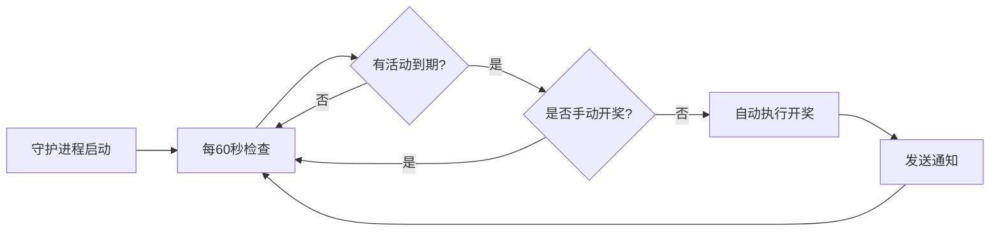

# 🚀 抽奖系统快速启动指南

## 一键启动所有服务

### Windows用户

双击运行项目根目录下的：
```
START_ALL.bat
```

会自动启动4个服务窗口：

| 窗口标题 | 服务说明 | 说明 |
|----------|----------|------|
| 🖥️ Backend Server | Django后端API服务 | http://localhost:8000 |
| 🌐 Frontend Server | Vue前端界面 | http://localhost:8080 |
| 🤖 Telegram Bot | Telegram机器人 | 后台运行 |
| ⏰ Auto Draw Scheduler | 自动开奖守护进程 | 每60秒检查一次 |

### ⚠️ 重要提示

**请不要关闭这4个命令行窗口！** 关闭窗口会停止对应的服务。

## 访问地址

启动完成后，可以访问：

- 📊 **管理后台**: http://localhost:8080
- 🔧 **API接口**: http://localhost:8000/api
- 👤 **Admin面板**: http://localhost:8000/admin
  - 用户名: `admin`
  - 密码: `admin123`

## 服务说明

### 1. Backend Server（后端服务）
- 提供RESTful API接口
- 处理抽奖业务逻辑
- 端口：8000

### 2. Frontend Server（前端服务）
- 提供Web管理界面
- 创建和管理抽奖活动
- 端口：8080

### 3. Telegram Bot（机器人）
- 处理用户参与抽奖
- 发送中奖通知
- 需要配置BOT_TOKEN

### 4. Auto Draw Scheduler（自动开奖）
- **每60秒自动检查一次**
- 到达结束时间自动开奖
- 仅对未手动开奖的活动生效
- 自动发送中奖通知

## 自动开奖工作原理



### 自动开奖条件

必须同时满足：
- ✅ 抽奖状态为 `active`（进行中）
- ✅ 当前时间 >= 结束时间
- ✅ 未手动开奖（`manual_drawn = False`）

### 手动开奖说明

- 可以在结束时间前随时手动开奖
- 手动开奖后会禁用自动开奖
- 超过结束时间无法手动开奖

## 停止服务

### 方法一：关闭窗口
直接关闭对应的命令行窗口即可停止该服务。

### 方法二：Ctrl+C
在对应窗口按 `Ctrl+C` 停止服务。

### 停止所有服务
关闭所有4个窗口。

## 查看日志

### 自动开奖日志
自动开奖守护进程的日志会实时显示在"Auto Draw Scheduler"窗口中：

```
[第 1 次检查] 开始扫描需要开奖的活动...
暂无需要开奖的活动
等待60秒后进行下次检查...

[第 2 次检查] 开始扫描需要开奖的活动...
发现 1 个需要自动开奖的活动
正在自动开奖: iPhone 15 Pro Max 抽奖活动 (ID: 17)
✓ 自动开奖成功: iPhone 15 Pro Max 抽奖活动 (ID: 17)
本次任务完成: 成功 1 个, 失败 0 个
等待60秒后进行下次检查...
```

## 常见问题

### Q1: 启动后某个窗口立即关闭？
**原因：** 该服务启动失败
**解决：**
1. 检查依赖是否安装（npm install / pip install）
2. 检查端口是否被占用（8000/8080）
3. 查看错误信息

### Q2: 自动开奖没有执行？
**检查项：**
- ✅ Auto Draw Scheduler窗口是否在运行
- ✅ 抽奖状态是否为 `active`
- ✅ 是否已到达结束时间
- ✅ 是否已手动开奖
- ✅ 查看窗口日志输出

### Q3: 前端无法访问？
**检查：**
- Backend Server窗口是否正常运行
- Frontend Server窗口是否正常运行
- 访问 http://localhost:8080

### Q4: 想单独启动某个服务？
**可以手动启动：**

```bash
# 启动后端
cd backend
python manage.py runserver

# 启动前端
cd frontend
npm run serve

# 启动机器人
cd bot
python bot.py

# 启动自动开奖
cd backend
python auto_draw_daemon.py
```

## 开发模式

如果你想修改代码并实时看到效果：

1. **后端**: 修改Python代码后自动重启（Django支持热重载）
2. **前端**: 修改Vue代码后自动刷新（npm支持热重载）
3. **机器人**: 需要手动重启
4. **自动开奖**: 需要手动重启

## 生产环境部署

生产环境建议：
- 使用 Nginx + Gunicorn 部署后端
- 使用 systemd 管理服务
- 使用 crontab 或 systemd timer 管理自动开奖
- 配置日志轮转
- 设置环境变量

详细部署说明请参考项目文档。

## 🎉 开始使用

现在你可以：
1. 访问 http://localhost:8080
2. 点击"创建抽奖"
3. 填写抽奖信息
4. 设置结束时间
5. 等待自动开奖或手动开奖

祝你使用愉快！🎊
