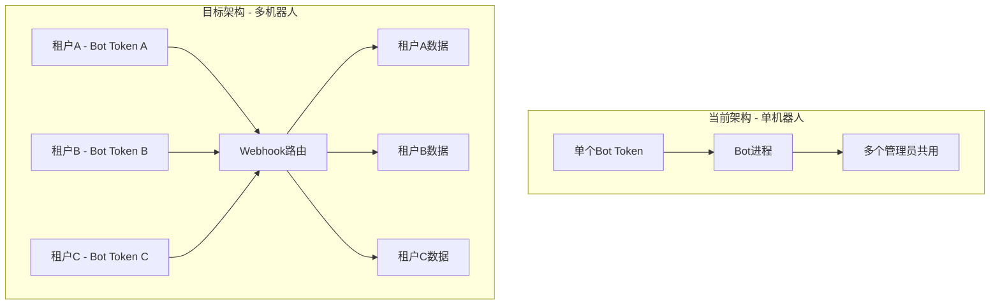

# 🤖 多租户多机器人实施方案

## 📊 架构设计

### 当前架构 vs 目标架构



## 🎯 实施方案：Webhook模式（推荐）

### 方案优势

✅ **单进程支持无限机器人**  
✅ **资源占用低**（一个Django进程即可）  
✅ **易于扩展**（新增租户无需重启）  
✅ **便于监控**（统一日志和管理）  
✅ **成本低**（适合商业化SaaS）

### 核心思路

1. **数据库存储**：每个租户保存自己的`bot_token`
2. **Webhook路由**：根据请求的bot_token动态路由到不同租户
3. **数据隔离**：基于`admin_user`区分数据
4. **动态注册**：租户添加token后自动注册webhook

## 📋 实施步骤

### 第一步：数据模型扩展

在`User`模型中添加机器人配置字段（通过Profile扩展）

```python
# models.py

class UserProfile(models.Model):
    """用户配置文件 - 扩展User模型"""
    user = models.OneToOneField(
        User,
        on_delete=models.CASCADE,
        related_name='profile',
        verbose_name='用户'
    )
    
    # 机器人配置
    bot_token = models.CharField(
        max_length=255,
        blank=True,
        null=True,
        verbose_name='Bot Token',
        help_text='从 @BotFather 获取的机器人Token'
    )
    
    bot_username = models.CharField(
        max_length=100,
        blank=True,
        null=True,
        verbose_name='机器人用户名',
        help_text='例如：@MyLotteryBot'
    )
    
    webhook_enabled = models.BooleanField(
        default=False,
        verbose_name='Webhook已启用',
        help_text='是否已成功注册Webhook'
    )
    
    webhook_url = models.URLField(
        blank=True,
        null=True,
        verbose_name='Webhook URL',
        help_text='Telegram Webhook地址'
    )
    
    # 租户信息
    company_name = models.CharField(
        max_length=200,
        blank=True,
        verbose_name='公司名称'
    )
    
    created_at = models.DateTimeField(auto_now_add=True, verbose_name='创建时间')
    updated_at = models.DateTimeField(auto_now=True, verbose_name='更新时间')
    
    class Meta:
        db_table = 'user_profiles'
        verbose_name = '用户配置'
        verbose_name_plural = verbose_name
    
    def __str__(self):
        return f"{self.user.username} - Profile"
```

### 第二步：Webhook视图实现

```python
# lottery/webhook_views.py

import json
import logging
from django.http import JsonResponse, HttpResponse
from django.views.decorators.csrf import csrf_exempt
from django.contrib.auth.models import User
from telegram import Update, Bot
from telegram.ext import Application, ContextTypes
from .models import UserProfile
from .bot_handlers import setup_handlers  # 我们需要创建这个

logger = logging.getLogger(__name__)

# 存储每个bot的Application实例
BOT_APPLICATIONS = {}


async def get_or_create_bot_application(bot_token: str):
    """获取或创建Bot Application实例"""
    if bot_token not in BOT_APPLICATIONS:
        application = Application.builder().token(bot_token).build()
        await setup_handlers(application)  # 注册处理器
        await application.initialize()
        BOT_APPLICATIONS[bot_token] = application
        logger.info(f"创建新的Bot Application: {bot_token[:10]}...")
    
    return BOT_APPLICATIONS[bot_token]


@csrf_exempt
async def telegram_webhook(request, bot_token):
    """
    Telegram Webhook 统一入口
    URL格式：/api/webhook/{bot_token}/
    """
    if request.method != 'POST':
        return HttpResponse('Method Not Allowed', status=405)
    
    try:
        # 1. 验证bot_token是否存在于系统中
        profile = UserProfile.objects.filter(bot_token=bot_token).first()
        if not profile:
            logger.warning(f"未找到对应的Bot Token: {bot_token[:10]}...")
            return HttpResponse('Forbidden', status=403)
        
        # 2. 解析Telegram Update
        update_data = json.loads(request.body.decode('utf-8'))
        logger.info(f"收到Webhook请求 - 租户: {profile.user.username}")
        
        # 3. 获取Bot Application
        application = await get_or_create_bot_application(bot_token)
        
        # 4. 处理Update（传入user_id用于数据隔离）
        update = Update.de_json(update_data, application.bot)
        
        # 5. 在context中注入当前租户信息
        context = application.context_types.context()
        context.user_data['admin_user_id'] = profile.user.id
        context.user_data['admin_username'] = profile.user.username
        
        # 6. 处理Update
        await application.process_update(update)
        
        return JsonResponse({'ok': True})
        
    except Exception as e:
        logger.error(f"处理Webhook失败: {str(e)}", exc_info=True)
        return JsonResponse({'ok': False, 'error': str(e)}, status=500)


@csrf_exempt
async def register_webhook(request):
    """
    为当前用户注册Webhook
    POST /api/bot/register-webhook/
    Body: {
        "bot_token": "your_bot_token",
        "webhook_url": "https://yourdomain.com/api/webhook/{bot_token}/"
    }
    """
    if request.method != 'POST':
        return HttpResponse('Method Not Allowed', status=405)
    
    try:
        data = json.loads(request.body.decode('utf-8'))
        bot_token = data.get('bot_token')
        webhook_url = data.get('webhook_url')
        
        if not bot_token:
            return JsonResponse({'error': 'bot_token必填'}, status=400)
        
        # 获取或创建用户Profile
        profile, created = UserProfile.objects.get_or_create(user=request.user)
        
        # 验证Bot Token
        bot = Bot(token=bot_token)
        bot_info = await bot.get_me()
        
        # 构造webhook URL
        if not webhook_url:
            # 自动构造（需要配置域名）
            domain = request.get_host()
            webhook_url = f"https://{domain}/api/webhook/{bot_token}/"
        
        # 注册Telegram Webhook
        result = await bot.set_webhook(url=webhook_url)
        
        if result:
            # 保存配置
            profile.bot_token = bot_token
            profile.bot_username = bot_info.username
            profile.webhook_url = webhook_url
            profile.webhook_enabled = True
            profile.save()
            
            logger.info(f"Webhook注册成功 - 用户: {request.user.username}, Bot: @{bot_info.username}")
            
            return JsonResponse({
                'ok': True,
                'message': 'Webhook注册成功',
                'bot_username': bot_info.username,
                'webhook_url': webhook_url
            })
        else:
            return JsonResponse({'error': 'Webhook注册失败'}, status=500)
            
    except Exception as e:
        logger.error(f"注册Webhook失败: {str(e)}", exc_info=True)
        return JsonResponse({'error': str(e)}, status=500)


@csrf_exempt
async def remove_webhook(request):
    """移除Webhook"""
    if request.method != 'POST':
        return HttpResponse('Method Not Allowed', status=405)
    
    try:
        profile = request.user.profile
        
        if not profile.bot_token:
            return JsonResponse({'error': '未配置Bot'}, status=400)
        
        # 删除Telegram Webhook
        bot = Bot(token=profile.bot_token)
        await bot.delete_webhook()
        
        # 清除配置
        profile.webhook_enabled = False
        profile.save()
        
        # 移除Application缓存
        if profile.bot_token in BOT_APPLICATIONS:
            del BOT_APPLICATIONS[profile.bot_token]
        
        logger.info(f"Webhook已移除 - 用户: {request.user.username}")
        
        return JsonResponse({'ok': True, 'message': 'Webhook已移除'})
        
    except Exception as e:
        logger.error(f"移除Webhook失败: {str(e)}", exc_info=True)
        return JsonResponse({'error': str(e)}, status=500)
```

### 第三步：Bot处理器（支持多租户）

```python
# lottery/bot_handlers.py

import logging
from telegram import Update, InlineKeyboardButton, InlineKeyboardMarkup
from telegram.ext import Application, CommandHandler, CallbackQueryHandler, ContextTypes
from .models import Lottery, TelegramUser, Participation
from django.utils import timezone

logger = logging.getLogger(__name__)


async def start_command(update: Update, context: ContextTypes.DEFAULT_TYPE):
    """启动命令"""
    user = update.effective_user
    
    # 获取当前租户ID
    admin_user_id = context.user_data.get('admin_user_id')
    
    # 保存或更新Telegram用户
    tg_user, created = TelegramUser.objects.get_or_create(
        telegram_id=user.id,
        defaults={
            'username': user.username,
            'first_name': user.first_name,
            'last_name': user.last_name
        }
    )
    
    if not created:
        tg_user.username = user.username
        tg_user.first_name = user.first_name
        tg_user.last_name = user.last_name
        tg_user.save()
    
    keyboard = [
        [InlineKeyboardButton("🎁 参与抽奖", callback_data='join_lottery')],
        [InlineKeyboardButton("🎊 我的抽奖", callback_data='my_lotteries')],
        [InlineKeyboardButton("❓ 帮助", callback_data='help')]
    ]
    reply_markup = InlineKeyboardMarkup(keyboard)
    
    await update.message.reply_text(
        f"👋 你好 {user.first_name}!\n\n"
        f"欢迎使用抽奖机器人 🎉\n\n"
        f"请选择功能：",
        reply_markup=reply_markup
    )


async def button_callback(update: Update, context: ContextTypes.DEFAULT_TYPE):
    """按钮回调处理"""
    query = update.callback_query
    await query.answer()
    
    # 获取当前租户ID
    admin_user_id = context.user_data.get('admin_user_id')
    
    if query.data == 'join_lottery':
        # 只显示当前租户的抽奖活动
        now = timezone.now()
        lotteries = Lottery.objects.filter(
            admin_user_id=admin_user_id,  # 关键：只显示当前租户的抽奖
            status='active',
            start_time__lte=now,
            end_time__gte=now
        )[:5]
        
        if not lotteries:
            await query.edit_message_text("暂无进行中的抽奖活动")
            return
        
        keyboard = []
        for lottery in lotteries:
            keyboard.append([
                InlineKeyboardButton(
                    f"🎁 {lottery.title}",
                    callback_data=f'participate_{lottery.id}'
                )
            ])
        keyboard.append([InlineKeyboardButton("« 返回主菜单", callback_data='main_menu')])
        
        reply_markup = InlineKeyboardMarkup(keyboard)
        await query.edit_message_text("请选择要参与的抽奖：", reply_markup=reply_markup)
    
    elif query.data.startswith('participate_'):
        lottery_id = int(query.data.split('_')[1])
        user = query.from_user
        
        try:
            lottery = Lottery.objects.get(id=lottery_id, admin_user_id=admin_user_id)
            tg_user = TelegramUser.objects.get(telegram_id=user.id)
            
            # 检查是否已参与
            if Participation.objects.filter(lottery=lottery, user=tg_user).exists():
                await query.answer("您已经参与过这个抽奖了！", show_alert=True)
                return
            
            # 创建参与记录
            Participation.objects.create(lottery=lottery, user=tg_user)
            
            await query.answer("参与成功！祝您好运 🍀", show_alert=True)
            await query.edit_message_text(
                f"✅ 已成功参与抽奖：{lottery.title}\n\n"
                f"开奖时间：{lottery.end_time.strftime('%Y-%m-%d %H:%M')}\n\n"
                f"祝您好运！🍀"
            )
            
        except Exception as e:
            logger.error(f"参与抽奖失败: {str(e)}")
            await query.answer("参与失败，请稍后重试", show_alert=True)
    
    elif query.data == 'my_lotteries':
        user = query.from_user
        tg_user = TelegramUser.objects.get(telegram_id=user.id)
        
        # 只显示当前租户的抽奖
        participations = Participation.objects.filter(
            user=tg_user,
            lottery__admin_user_id=admin_user_id  # 关键：数据隔离
        ).order_by('-participated_at')[:10]
        
        if not participations:
            await query.edit_message_text("您还没有参与任何抽奖")
            return
        
        text = "您参与的抽奖：\n\n"
        for p in participations:
            text += f"🎁 {p.lottery.title}\n"
            text += f"   状态：{p.lottery.get_status_display()}\n\n"
        
        await query.edit_message_text(text)


async def setup_handlers(application: Application):
    """设置处理器"""
    application.add_handler(CommandHandler("start", start_command))
    application.add_handler(CallbackQueryHandler(button_callback))
    logger.info("Bot处理器已注册")
```

### 第四步：URL路由配置

```python
# lottery/urls.py

from django.urls import path
from . import webhook_views

urlpatterns = [
    # ... 现有路由 ...
    
    # Webhook路由
    path('webhook/<str:bot_token>/', webhook_views.telegram_webhook, name='telegram-webhook'),
    path('bot/register-webhook/', webhook_views.register_webhook, name='register-webhook'),
    path('bot/remove-webhook/', webhook_views.remove_webhook, name='remove-webhook'),
]
```

### 第五步：前端界面（Bot配置页面）

```vue
<!-- frontend/src/views/BotSettings.vue -->

<template>
  <div class="bot-settings">
    <el-card>
      <template #header>
        <h2>🤖 机器人配置</h2>
      </template>
      
      <el-alert 
        v-if="!botConfig.bot_token" 
        type="info" 
        :closable="false"
        style="margin-bottom: 20px;"
      >
        <template #title>
          <strong>如何获取Bot Token？</strong>
        </template>
        <ol>
          <li>在Telegram搜索 <code>@BotFather</code></li>
          <li>发送 <code>/newbot</code> 创建新机器人</li>
          <li>按提示设置机器人名称和用户名</li>
          <li>复制获得的Token，粘贴到下方</li>
        </ol>
      </el-alert>
      
      <el-form :model="botConfig" label-width="120px">
        <el-form-item label="Bot Token">
          <el-input 
            v-model="botConfig.bot_token" 
            placeholder="例如：123456:ABC-DEF1234ghIkl-zyx57W2v1u123ew11"
            :disabled="botConfig.webhook_enabled"
          />
        </el-form-item>
        
        <el-form-item label="Webhook URL">
          <el-input 
            v-model="botConfig.webhook_url" 
            placeholder="自动生成"
            disabled
          />
          <div style="color: #909399; font-size: 12px; margin-top: 5px;">
            将自动生成：https://yourdomain.com/api/webhook/{bot_token}/
          </div>
        </el-form-item>
        
        <el-form-item label="状态">
          <el-tag v-if="botConfig.webhook_enabled" type="success">
            ✅ 已启用
          </el-tag>
          <el-tag v-else type="info">
            ⏸️ 未启用
          </el-tag>
        </el-form-item>
        
        <el-form-item v-if="botConfig.bot_username" label="机器人">
          <a 
            :href="`https://t.me/${botConfig.bot_username}`" 
            target="_blank"
          >
            @{{ botConfig.bot_username }}
          </a>
        </el-form-item>
        
        <el-form-item>
          <el-button 
            v-if="!botConfig.webhook_enabled" 
            type="primary" 
            @click="registerWebhook"
            :loading="loading"
          >
            启用机器人
          </el-button>
          <el-button 
            v-else 
            type="danger" 
            @click="removeWebhook"
            :loading="loading"
          >
            停用机器人
          </el-button>
        </el-form-item>
      </el-form>
    </el-card>
  </div>
</template>

<script>
import api from '../api'

export default {
  name: 'BotSettings',
  data() {
    return {
      botConfig: {
        bot_token: '',
        webhook_url: '',
        webhook_enabled: false,
        bot_username: ''
      },
      loading: false
    }
  },
  mounted() {
    this.loadBotConfig()
  },
  methods: {
    async loadBotConfig() {
      try {
        const config = await api.getBotConfig()
        this.botConfig = config
      } catch (error) {
        console.error('加载配置失败:', error)
      }
    },
    
    async registerWebhook() {
      if (!this.botConfig.bot_token) {
        this.$message.error('请先填写Bot Token')
        return
      }
      
      try {
        this.loading = true
        const result = await api.registerWebhook({
          bot_token: this.botConfig.bot_token
        })
        
        this.$message.success('机器人启用成功！')
        this.botConfig = result
        
      } catch (error) {
        this.$message.error('启用失败：' + (error.response?.data?.error || '请检查Token是否正确'))
      } finally {
        this.loading = false
      }
    },
    
    async removeWebhook() {
      try {
        await this.$confirm('确定要停用机器人吗？', '提示', {
          type: 'warning'
        })
        
        this.loading = true
        await api.removeWebhook()
        
        this.$message.success('机器人已停用')
        this.botConfig.webhook_enabled = false
        
      } catch (error) {
        if (error !== 'cancel') {
          this.$message.error('操作失败')
        }
      } finally {
        this.loading = false
      }
    }
  }
}
</script>
```

## 🚀 部署要求

### 必需条件

1. **公网域名**：例如 `yourdomain.com`
2. **SSL证书**：Telegram要求HTTPS（推荐使用Let's Encrypt免费证书）
3. **Nginx配置**：反向代理到Django

### Nginx配置示例

```nginx
server {
    listen 443 ssl;
    server_name yourdomain.com;
    
    ssl_certificate /path/to/fullchain.pem;
    ssl_certificate_key /path/to/privkey.pem;
    
    location /api/webhook/ {
        proxy_pass http://127.0.0.1:8000;
        proxy_set_header Host $host;
        proxy_set_header X-Real-IP $remote_addr;
    }
    
    location /api/ {
        proxy_pass http://127.0.0.1:8000;
    }
    
    location / {
        proxy_pass http://127.0.0.1:8080;  # 前端
    }
}
```

## 📊 商业化优势

| 特性 | 说明 | 价值 |
|------|------|------|
| **按需付费** | 根据机器人数量收费 | 💰 灵活定价 |
| **快速上线** | 客户配置即可使用 | ⚡ 降低门槛 |
| **集中管理** | 统一后台管理所有租户 | 📊 易于运维 |
| **数据隔离** | 完全独立的数据空间 | 🔒 安全可靠 |
| **无限扩展** | 理论上支持无限租户 | 📈 可扩展性强 |

## ⚠️ 注意事项

1. **安全性**：
   - Bot Token是敏感信息，需要加密存储
   - 建议使用Django的`encrypt`字段或环境变量

2. **限流**：
   - Telegram有API调用限制
   - 建议实现请求队列

3. **监控**：
   - 记录每个租户的API调用情况
   - 及时发现异常

4. **备用方案**：
   - 如果无法使用Webhook（没有域名），可以使用长轮询模式
   - 但需要为每个租户启动独立进程

## 🔄 迁移步骤

1. ✅ 数据库迁移（添加UserProfile表）
2. ✅ 实现Webhook视图
3. ✅ 前端添加Bot配置页面
4. ✅ 测试单个租户
5. ✅ 测试多个租户数据隔离
6. ✅ 部署到生产环境（配置域名+SSL）

## 💡 下一步

我可以帮您：
1. 立即实现这个方案的代码
2. 或者先用Polling模式实现简单版（无需域名）
3. 或者讨论其他方案

您希望如何进行？

